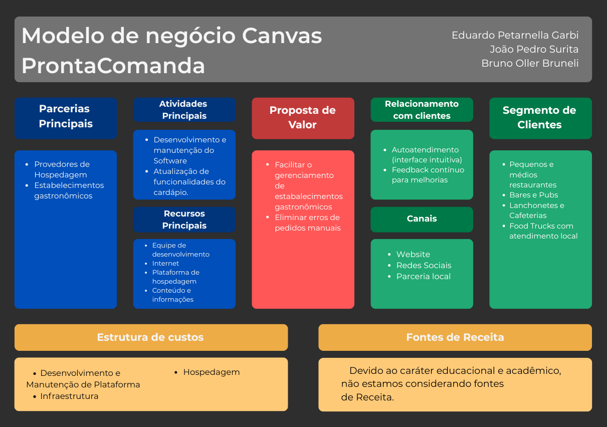
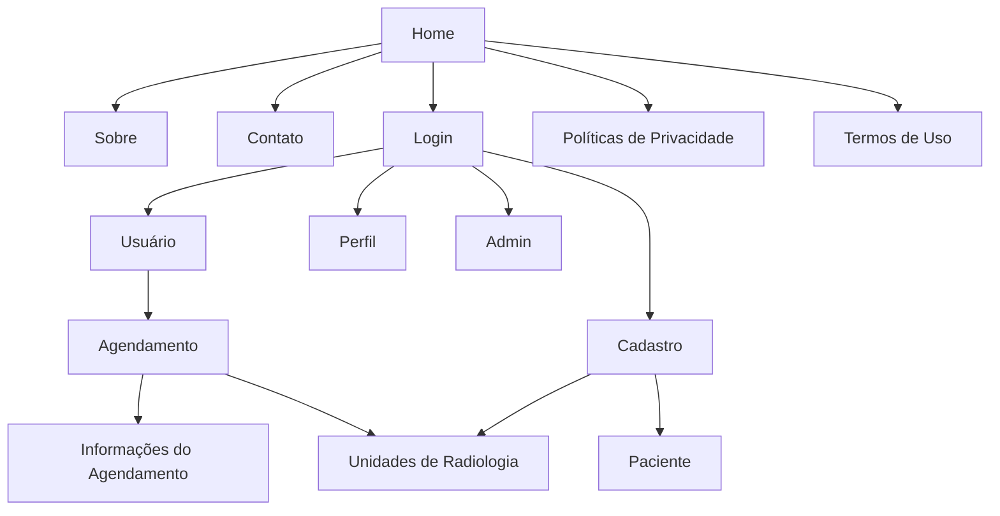
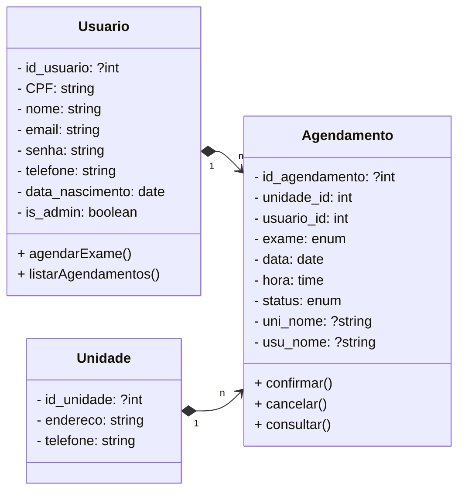

  <picture>
    <source media="(prefers-color-scheme: dark)" srcset="app/wwwroot/img/logo-dark.svg">
    <source media="(prefers-color-scheme: light)" srcset="app/wwwroot/img/logo.svg">
    
  </picture>
  
  # ProntaComanda
  ### Centro Paula Souza
  ### Faculdade de Tecnologia de Jahu 
  ### Curso de Tecnologia em Desenvolvimento de Software Multiplataforma
  ### Jaú, SP, BR
  ### Início: 3º Semestre / 2026
  # Documento da aplicação web

# Autores:
<h3 align="center">
   &nbsp;
  <a href="https://www.linkedin.com/in/joaosurita/">João Pedro Surita</a>;
  <a href="https://www.linkedin.com/in/brunoobrunelli/">Bruno Oller Brunelli</a>;
  <a href="https://www.linkedin.com/in/eduardo-petarnella-gabri-18986b353/">Eduardo Petarnella Gabri</a>.
</h3>

<h1>Sumário</h1>

  - [1. Resumo da aplicação web](#1-resumo-da-aplicação-web)
    - [1.1. Objetivos](#11-objetivos)
    - [1.2 Métodos da pesquisa](#12-métodos-da-pesquisa)
  - [2. Documento de requisitos](#2-documento-de-requisitos)
    - [2.1. Requisitos funcionais](#21-requisitos-funcionais)
    - [2.2. Requisitos não funcionais](#22-requisitos-não-funcionais)
  - [3. Regras de negócio](#3-regras-de-negócio)
    - [3.1. O que será elaborado?](#31-o-que-será-elaborado)
    - [3.2. Como será elaborado?](#32-como-será-elaborado)
    - [3.3. Para quem será elaborado?](#33-para-quem-será-elaborado)
    - [3.4. Quanto custará?](#34-quanto-custará)
  - [4. Estudo de viabilidade](#4-estudo-de-viabilidade)
  - [5. Design](#5-design)
  - [6. Protótipo](#6-protótipo)
  - [7. Aplicação](#7-aplicação)
  - [8. Considerações finais](#8-considerações-finais)
  - [Referências bibliográficas](#referências-bibliográficas)

# 1. Resumo da aplicação web
O ProntaComanda é um sistema desenvolvido para otimizar a gestão operacional de estabelecimentos gastronômicos, eliminando gargalos no atendimento e modernizando o controle interno de pedidos. O principal objetivo é centralizar e agilizar o fluxo de trabalho, permitindo que gestores e colaboradores controlem o consumo por mesas e a disponibilidade de itens de forma prática, remota e eficiente.

Através de uma interface intuitiva, o sistema permite o gerenciamento dinâmico de mesas e a atualização em tempo real do cardápio, garantindo que a comunicação entre o salão e a cozinha seja instantânea. Isso reduz erros de anotação e minimiza o tempo de espera dos clientes, elevando o padrão de serviço oferecido.

Além de aprimorar a experiência do consumidor, o ProntaComanda oferece uma visão estratégica para o negócio, possibilitando uma distribuição mais equilibrada das demandas e um controle rigoroso do inventário. Dessa forma, a plataforma promove não apenas agilidade no atendimento, mas também uma maior eficiência administrativa para empreendedores que buscam profissionalizar a gestão de seus estabelecimentos.

## 1.2. Métodos da pesquisa
O desenvolvimento deste projeto conta com o apoio da infraestrutura da Fatec de Jahu. As atividades são realizadas tanto durante as aulas quanto em horários livres, utilizando os computadores dos laboratórios da instituição, assim como os dispositivos pessoais dos membros da equipe.

Para a criação da interface e da estrutura da aplicação, estão sendo empregadas as linguagens HTML, CSS e JavaScript, junto com o framework Bootstrap. O protótipo visual está sendo elaborado no Figma, que permite a colaboração entre os integrantes e facilita a definição do design das telas.

O back-end do sistema será implementado em C#, com o banco de dados MongoDB. O código-fonte é editado no Visual Studio e gerenciado por meio do Git, garantindo controle das versões e organização durante todo o processo de desenvolvimento.

<h3 align="center">
   &nbsp;&nbsp;
   &nbsp;&nbsp;
   &nbsp;&nbsp;
   &nbsp;&nbsp;
   &nbsp;&nbsp;
   &nbsp;&nbsp;
   &nbsp;&nbsp;
  
   &nbsp;&nbsp;
</h3>

Todo o projeto está sendo desenvolvido nas instalações da Fatec de Jahu, que fornece a infraestrutura e o suporte necessários para a execução das atividades. As tarefas são realizadas ao longo do semestre do curso, integrando-se aos conteúdos das disciplinas, o que permite aplicar de forma prática os conhecimentos adquiridos em sala de aula.

[Voltar para o início](#inicio)

# 2. Documento de requisitos
Um documento de requisitos de sistema descreve o que o sistema deve fazer, suas funções, regras e limitações. Ele serve como guia para o desenvolvimento, ajudando a garantir que o sistema atenda às necessidades dos usuários e funcione corretamente.

## 2.1. Requisitos funcionais

### RF1 - Cadastro de Produtos
O sistema deve permitir a inclusão, alteração e exclusão de itens (nome, preço, categoria).
### RF2 - Controle de Disponibilidade
O sistema deve ativar ou desativar itens do cardápio conforme o estoque.
### RF3 - Categorização de Itens
O sistema deve permitir agrupar produtos para facilitar a navegação (ex: Entradas, Bebidas).
### RF4 - Monitoramento de Status
O sistema deve exibir em tempo real se a mesa está livre, ocupada ou reservada.
### RF5 - Abertura de Comanda
O sistema deve vincular o início de um atendimento a uma numeração de mesa específica.
### RF6 - Lançamento de Consumo
O sistema deve permitir adicionar produtos à conta ativa de uma mesa.
### RF7 - Remanejamento de Mesa
O sistema deve permitir transferir pedidos ou unir contas de mesas diferentes.
### RF8 - Transmissão de Pedidos
O sistema deve enviar automaticamente as solicitações do salão para a produção (Cozinha/Bar).
### RF9 - Gestão de Preparo
O sistema deve atualizar o estágio do prato (Pendente, Em Preparo, Finalizado).
### RF10 - Log de Tempo
O sistema deve registrar o tempo decorrido entre o pedido e a entrega.
### RF11 - Cálculo de Subtotal
O sistema deve somar automaticamente todos os itens consumidos na comanda.
### RF12 - Ajuste de Valores
O sistema deve permitir aplicar descontos, cortesias ou taxas de serviço no total da conta.
### RF13 - Controle de Acesso
O sistema deve permitir restringir funções por nível de usuário (Admin, Garçom, Cozinheiro).
### RF14 - Relatório de Vendas
O sistema deve permitir gerar demonstrativos de faturamento e produtividade por período.

## 2.2. Requisitos não funcionais

### RNF1 - Desempenho
O sistema deve ser capaz de processar agendamentos rapidamente, proporcionando uma navegação fluida para o usuário.
### RNF2 - Usabilidade
A interface deve ser intuitiva, acessível e adaptável a diferentes tamanhos de telas, como computadores, tablets e celulares.
### RNF3 - Portabilidade
O sistema deve funcionar corretamente nos principais navegadores de internet e dispositivos móveis.
### RNF4 - Manutenção
O sistema deve ser de fácil manutenção, com documentação clara e organizada, permitindo futuras atualizações e correções.
### RNF5 - Suporte
Deve ser disponibilizado suporte técnico para solucionar eventuais problemas no funcionamento da aplicação.
### RNF6 - Segurança
O sistema deve proteger as informações dos usuários, assegurando a privacidade e a integridade dos dados.
### RNF7 - Disponibilidade
O sistema deve estar disponível para uso na maior parte do tempo, com interrupções mínimas e programadas.
### RNF8 - Controle
O desenvolvimento será acompanhado de boas práticas para facilitar a gestão e o versionamento do sistema.
### RNF9 - Acessibilidade
O sistema deve respeitar padrões de acessibilidade para garantir o uso por pessoas com diferentes tipos de necessidades.
### RNF10 - Tolerância a falhas
O sistema deve garantir que os dados não sejam perdidos em caso de falhas, mantendo cópias de segurança.
### RNF11 - Compatibilidade
O sistema deve ser compatível com outras soluções administrativas utilizadas pelas unidades de saúde.

[Voltar para o início](#inicio)

# 3. Regras de negócio
### Figura 1 - Canvas, modelo de negócios:

  

## 3.1. O que será elaborado?
### Proposta de valor:
  - Facilitar o gerenciamento de estabalecimentos gastronômicos
  - Eliminar erros de pedidos manuais

## 3.2. Como será elaborado?
### Parcerias Principais:
  - Provedores de Hospedagem
  - Estabelecimentos gastronômicos

### Atividades Principais:
  - Desenvolvimento e manutenção do Software
  - Atualização de funcionalidades do cardápio

### Recursos principais:
  - Equipe de desenvolvimento
  - Internet
  - Plataforma de hospedagem
  - Conteúdo e informações

## 3.3. Para quem será elaborado?
### Segmento de mercado:
  - Pequenos e médios restaurantes
  - Bares e Pubs
  - Lanchonetes e Cafeterias
  - Food Trucks com atendimento local

### Relacionamento com o cliente: 
  - Autoatendimento (interface intuitiva)
  - Feedback contínuo para melhorias
    
### Canais: 
  - Website
  - Redes Sociais
  - Parceria local
    
## 3.4. Quanto custará?
### Estrutura de custos: 
  - Domínio da aplicação;
  - Desenvolvimento e manutenção;
  - Custo de patente;
  - Suporte ao cliente.
### Fontes de renda: 
  - Devido ao caráter educacional e acadêmico, não estamos considerando fontes de Receita.

[Voltar para o início](#inicio)

# 4. Estudo de viabilidade
### Viabilidade técnica: 
O sistema é tecnicamente viável, pois será desenvolvido com tecnologias robustas e consolidadas no mercado, como HTML, CSS, JavaScript e C#, utilizando o padrão MVC para garantir uma manutenção facilitada e escalabilidade. A integração com o banco de dados MongoDB permite um gerenciamento de dados seguro e performático. O uso de ambientes de desenvolvimento como Visual Studio.

### Viabilidade financeira: 
O projeto demonstra alta viabilidade financeira, visto que se baseia na utilização de ferramentas de código aberto (open-source), eliminando custos elevados com licenças de software. O investimento inicial é reduzido, concentrando-se principalmente na hospedagem e manutenção básica. Ao aproveitar a infraestrutura acadêmica e tecnologias gratuitas, o ProntaComanda se posiciona como uma solução de baixo custo operacional e alta sustentabilidade econômica para micro e pequenos estabelecimentos.

### Viabilidade de mercado: 
O ProntaComanda possui forte viabilidade de mercado, inserindo-se na crescente demanda por transformação digital no setor de Food Service. Com a necessidade constante de bares e restaurantes em reduzir erros de pedido e aumentar o giro de mesas, uma ferramenta que simplifica a gestão do cardápio e o atendimento torna-se altamente competitiva. A solução atende diretamente empreendedores que buscam profissionalizar o serviço sem o alto investimento de softwares de gestão (ERP) complexos.

### Viabilidade operacional: 
O sistema é operacionalmente viável, priorizando uma interface limpa e intuitiva que se adapta à rotina acelerada de garçons e gestores. A curva de aprendizado é mínima, permitindo que a equipe comece a operar o gerenciamento de mesas e pedidos com agilidade, sem interromper o fluxo de trabalho atual. A centralização das informações reduz a falha de comunicação entre o salão e a cozinha, otimizando o tempo de entrega e elevando a qualidade do atendimento final.

[Voltar para o início](#inicio)

# 5. Design
### Paleta de cores:

| Nome             | Hexadecimal | Cor |
|------------------|:-----------:|:---:|
| Space Indigo      | #292B3B     |  |
| Platinum          | #EDF2F4     |  |
| Strawberry Red    | #EF233C     |  |
| Flag Red          | #D90429     |  |
| Grey              | #A6A9AE     |  |

### Tipografia: 
- [Archivo(Títulos) - Google Fonts](https://fonts.google.com/specimen/Archivo)
- [Rubik - Google Fonts](https://fonts.google.com/specimen/Rubik)

### Modelo de navegação:

[Voltar para o início](#inicio)

# 6. Protótipo
- ### Link do protótipo com a ferramenta Figma: [Figma - AGEND+](https://www.figma.com/design/DK7p6uT6eyjD93F4SaufMc/AGEND----Site?node-id=0-1&t=EdMXWmEnD2Meu3UL-1)

- ### Figura 2 - Protótipo da página principal Home:

  

- ### Figura 3 - Protótipo da tela de perfil do usuário:

  

[Voltar para o início](#inicio)

# 7. Aplicação
- ### Link para o nosso repositório do GitHub: [Repositório - AGENDMAIS](https://github.com/BrunoOller/AGENDMAIS)
  
- ### Figura 4 - Página Home:

  

- ### Figura 5 - Página Perfil do Usuário:

  

[Voltar para o início](#inicio)

# 8. Diagramas da aplicação
Os diagramas da aplicação representam de forma visual a estrutura e o funcionamento do sistema, auxiliando na compreensão e no planejamento do projeto. Por meio da notação UML, é possível visualizar as principais interações, classes e entidades do banco de dados, facilitando o entendimento entre todos os envolvidos no desenvolvimento.

## 8.1. Diagrama de Casos de Uso
Mostra como os usuários interagem com o sistema e quais são as principais funcionalidades disponíveis. Ajuda a identificar os papéis dos atores e os fluxos de uso da aplicação.
- ### Figura 6:

  

## 8.2. Diagrama de Classes
Apresenta a estrutura interna do sistema, mostrando as classes, seus atributos, métodos e relacionamentos. Permite compreender a organização do código e a relação entre os componentes.

## 8.3. Diagrama de Banco de Dados
Representa as tabelas e os relacionamentos que compõem a base de dados do sistema. Serve para planejar e documentar a forma como as informações serão armazenadas e conectadas.
- ### Figura 7:

  

[Voltar para o início](#inicio)

# 8. Considerações finais
A aplicação ProntaComanda foi desenvolvida com o objetivo de modernizar e agilizar a gestão de atendimento em estabelecimentos gastronômicos, oferecendo uma solução robusta para o controle de mesas e cardápios. Ao utilizar tecnologias de alta performance como C# e o banco de dados NoSQL MongoDB, o projeto superou limitações comuns de sistemas estáticos, permitindo o armazenamento dinâmico de dados e uma estrutura flexível para a expansão de funcionalidades.

Durante o desenvolvimento, o foco principal foi a implementação da lógica de negócios e a persistência de dados orientada a documentos, o que trouxe desafios técnicos enriquecedores, especialmente na modelagem de objetos e na integração entre o back-end e o banco de dados. Embora o escopo inicial tenha se concentrado nas funcionalidades vitais de operação (mesas e cardápio), o sistema foi projetado sob o padrão MVC, garantindo que futuras atualizações, como módulos de relatórios avançados ou integração com sistemas de pagamento, possam ser implementadas com facilidade.

Em suma, o ProntaComanda cumpre seu propósito de demonstrar como a tecnologia pode eliminar falhas de comunicação e otimizar a eficiência operacional no setor de Food Service. O projeto não apenas entrega uma ferramenta funcional para o mercado, mas também consolida o aprendizado em arquiteturas modernas de software e bancos de dados não relacionais.

[Voltar para o início](#inicio)

# Referências bibliográficas
ATLASSIAN. Trello. 2025. Disponível em: [https://trello.com/](https://trello.com/). 

FIGMA, Inc. Figma: the collaborative interface design tool. 2025. Disponível em: [https://www.figma.com/](https://www.figma.com/).

MIND THE GRAPH. O que é um estudo de viabilidade em pesquisa? 2023. Disponível em: [https://mindthegraph.com/blog/pt/o-que-e-um-estudo-de-viabilidade-em-pesquisa/](https://mindthegraph.com/blog/pt/o-que-e-um-estudo-de-viabilidade-em-pesquisa/).

SEBRAE. Canvas Sebrae. 2025. Disponível em: [https://canvas-apps.pr.sebrae.com.br/canvas](https://canvas-apps.pr.sebrae.com.br/canvas).

BOOTSTRAP. Bootstrap · The most popular HTML, CSS, and JS library in the world. 2025. Disponível em: [https://getbootstrap.com/](https://getbootstrap.com/). 

[Voltar para o início](#inicio)
